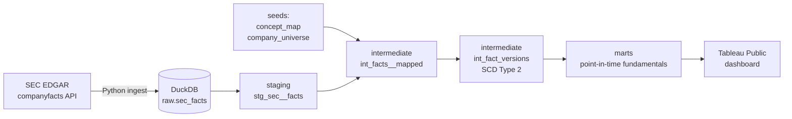

# Point-in-Time Equity Fundamentals Warehouse

[](https://github.com/rajib-k-das/point-in-time-fundamentals/actions/workflows/ci.yml)

A dbt + DuckDB warehouse that answers the question equity analysts actually need answered:
**"What did the market know about this company's financials *on this date*?"**

## The problem

Companies revise their reported numbers. FY2022 revenue can appear in the original 10-K,
again as a comparative in next year's 10-K, and again in an amendment (10-K/A) with a
different value. Most financial datasets keep only the *latest* value and overwrite history.

That silently corrupts any backtest or stock screen: a strategy tested on 2023 data ends up
"knowing" restated figures that weren't published until later. This is **lookahead bias**,
and it makes historical results look better than they could ever have been in real time.

This project models every reported value with the date it became public, so any metric
can be queried **as of** any date.

## What it produces

| Layer | Output | Status |
|---|---|---|
| Ingestion | Raw SEC EDGAR company facts for 28 US large caps, every filing kept | ✅ Done |
| Staging | Typed, de-duplicated facts with a surrogate key | ✅ Done |
| Intermediate | XBRL tags mapped to standard metrics, period grain classified | ✅ Done |
| Intermediate | Restatement history as SCD Type 2 (`valid_from` / `valid_to`), with scale-error flags | ✅ Done |
| Intermediate | Tag-switch check on restatements (decision 012) | 🔄 In progress |
| Intermediate | Derived Q4 values (annual minus nine-month year-to-date) | ⏳ Planned |
| Marts | `dim_company`, `dim_date`, point-in-time `fct_fundamentals` | ⏳ Planned |
| Marts | Screening metrics: Piotroski F-score, accruals ratio, margins | ⏳ Planned |
| BI | Tableau Public screening and restatement dashboard | ⏳ Planned |

## Architecture



## What the data showed

Across 28 companies and 61,289 reported values, **7.5% of re-reported values changed** from what was first published.
But the changes were not all restatements:

- **XBRL scale errors:** Coca-Cola's diluted share count was first tagged as 4,295 instead of 4,295,000,000;
  NVIDIA's was off by 1,000×. A naive warehouse would record these as +99,999,900% "restatements".
- **Rounding noise:** Walmart revenue moved 114,070M → 114,071M → 114,070M across filings.
- **Genuine revisions:** amendments, and re-presentations after divestitures or new accounting standards.

The SCD Type 2 model (`int_fact_versions`) keeps every meaningful version, ignores rounding noise, and flags
scale errors so screening can exclude them without rewriting history.

### Point-in-time lookup

```sql
select metric, value
from intermediate.int_fact_versions
where ticker = 'AAPL'
  and valid_from <= date '2023-03-01'
  and (valid_to is null or date '2023-03-01' < valid_to)
```

Or run `python scripts/run_analysis.py as_of_lookup --vars '{"as_of_date": "2023-03-01", "ticker": "AAPL"}'`.

## Key design decisions

The reasoning behind each modeling choice is logged in [`docs/decisions.md`](docs/decisions.md).
Highlights:

- **Keep every filing, not just the latest value.** Point-in-time queries are impossible otherwise.
- **Seed-driven concept mapping with priorities.** Companies tag revenue at least four different ways;
  a version-controlled mapping table makes the choice explicit, reviewable, and testable.
- **Version only on meaningful change.** 92.5% of re-reports repeat the same value; changes of 0.01% or less are rounding.
- **Keep scale errors, but flag them.** Point-in-time history stays honest; screens filter them out.
- **Known the day after filing.** Filings often land after the close, so same-day use would leak information.
- **Financial-sector companies excluded.** Banks don't report gross profit or current assets,
  so standard screening scores don't apply to them.

## Tech stack

Python (requests, pandas) · DuckDB · dbt Core · SQL · GitHub Actions (CI) · Tableau Public

## How to run it

Requires Python 3.11+.

```bash
python3 -m venv .venv && source .venv/bin/activate
pip install -r requirements.txt

cp .env.example .env              # then add your name and email (required by SEC)
python ingest/fetch_sec_facts.py  # download SEC data and load it into DuckDB
dbt build                         # build all models and run all data tests
```

To run without downloading anything, load the synthetic test fixture instead:

```bash
python ingest/fetch_sec_facts.py --offline --raw-dir tests/fixtures
dbt build
```

## Data source

[SEC EDGAR XBRL company facts API](https://www.sec.gov/edgar/sec-api-documentation) — free, public,
no API key. Requests follow SEC fair-access rules (identified User-Agent, under 10 requests per second).
