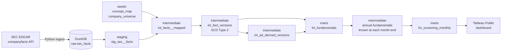

# Point-in-Time Equity Fundamentals Warehouse

[](https://github.com/rajib-k-das/point-in-time-fundamentals/actions/workflows/ci.yml)

A dbt + DuckDB warehouse that answers the question equity analysts actually need answered:
**"What did the market know about this company's financials *on this date*?"**

## The problem

Companies revise their reported numbers. FY2022 revenue can appear in the original 10-K,
again as a comparative in next year's 10-K, and again in an amendment (10-K/A) with a
different value. Most financial datasets keep only the *latest* value and overwrite history.

That silently corrupts any backtest or stock screen: a strategy tested on 2023 data ends up
"knowing" restated figures that weren't published until later. This is **lookahead bias**,
and it makes historical results look better than they could ever have been in real time.

This project models every reported value with the date it became public, so any metric
can be queried **as of** any date.

## What it produces

| Layer | Output | Status |
|---|---|---|
| Ingestion | Raw SEC EDGAR company facts for 28 US large caps, every filing kept | ✅ Done |
| Staging | Typed, de-duplicated facts with a surrogate key | ✅ Done |
| Intermediate | XBRL tags mapped to standard metrics, period grain classified | ✅ Done |
| Intermediate | Restatement history as SCD Type 2 (`valid_from` / `valid_to`), with scale-error flags | ✅ Done |
| Intermediate | Tag-switch audit: non-equivalent tags split into separate metrics, equivalent switches flagged | ✅ Done |
| Intermediate | Derived Q4 values (annual minus nine-month YTD), versioned by the overlap of both inputs | ✅ Done |
| Marts | `dim_company`, `dim_date`, point-in-time `fct_fundamentals` | ✅ Done |
| Marts | Monthly screen: Piotroski F-score, accruals ratio, margins, total debt | ✅ Done |
| BI | Tableau Public screening and restatement dashboard | ⏳ Planned |

## Architecture



## What the data showed

Across 28 companies and 61,289 reported values, **7.5% of re-reported values changed** from what was first published.
But the changes were not all restatements:

- **XBRL scale errors:** Coca-Cola's diluted share count was first tagged as 4,295 instead of 4,295,000,000;
  NVIDIA's was off by 1,000×. A naive warehouse would record these as +99,999,900% "restatements".
- **Rounding noise:** Walmart revenue moved 114,070M → 114,071M → 114,070M across filings.
- **Mapping artifacts:** shareholders' equity looked restated for 29% of facts, three times any other metric. In fact,
  91% of those "restatements" were filings switching between equity *with* and *without* non-controlling interest.
  Splitting them into two metrics cut equity's restatement rate from **29.2% to 1.9%**.
- **Trailing figures posing as fiscal years:** Amazon's 10-Qs report trailing-twelve-month cash flows, which a
  duration-only rule mistook for a fiscal year ending in June. A fiscal year now requires a 10-K.
- **Genuine revisions:** amendments, and re-presentations after divestitures or new accounting standards
  (e.g. revenue re-tagged and restated under ASC 606 in 2018, flagged as `is_tag_switch`).

After cleaning, **6.1% of facts (1,801 of 29,398) were genuinely restated at least once**, down from a naive 8.2%.
The SCD Type 2 model (`int_fact_versions`) keeps every meaningful version, ignores rounding noise, and flags
scale errors (20) and equivalent-tag switches (125) so screening can exclude or audit them without rewriting history.

| Measure | Before cleaning | After |
|---|---|---|
| Facts ever restated | 2,243 (8.2%) | 1,801 (6.1%) |
| Shareholders' equity restated | 29.2% of facts | 1.9% |
| Restatements flagged as scale errors | — | 20 |
| Restatements flagged as tag switches | — | 125 (revenue 92, cost of revenue 33) |

### Point-in-time lookup

```sql
select metric, value
from intermediate.int_fact_versions
where ticker = 'AAPL'
  and valid_from <= date '2023-03-01'
  and (valid_to is null or date '2023-03-01' < valid_to)
```

Or run `python scripts/run_analysis.py as_of_lookup --vars '{"as_of_date": "2023-03-01", "ticker": "AAPL"}'`.

## The screen

`fct_screening_monthly` scores every company at every month-end using only what was public that day:
the **Piotroski F-score** (nine signals; unknown inputs are reported as unknown, never as zero),
the **Sloan accruals ratio**, gross / operating / net / free-cash-flow margins, and **total debt**.

Point-in-time changes the answer. In the test fixture, the same company scores **8 of 8** in March 2023,
because its share count had been filed with a scale error, and **9 of 9** in March 2024, after the correction.
A warehouse that keeps only the latest values would report 9 for both dates.

## Testing

64 dbt tests run on every push (GitHub Actions), including:

- **Point-in-time integrity:** one current version per fact, and no gaps or overlaps in validity windows.
- **Mapping integrity:** each XBRL tag feeds one metric, and no metric mixes units or period types.
- **Known answers:** a synthetic company with hand-calculated results (Q4 33 → 27 after an amendment,
  F-score 8 → 9 after a scale-error correction). Breaking the Q4 formula fails this test.

## Key design decisions

The reasoning behind each modeling choice is logged in [`docs/decisions.md`](docs/decisions.md).
Highlights:

- **Keep every filing, not just the latest value.** Point-in-time queries are impossible otherwise.
- **Seed-driven concept mapping with priorities.** Companies tag revenue at least four different ways;
  a version-controlled mapping table makes the choice explicit, reviewable, and testable.
- **Version only on meaningful change.** 92.5% of re-reports repeat the same value; changes of 0.01% or less are rounding.
- **Different numbers, different metrics.** Tags that can disagree for the same period never share a metric; a test enforces it.
- **Keep scale errors, but flag them.** Point-in-time history stays honest; screens filter them out.
- **Known the day after filing.** Filings often land after the close, so same-day use would leak information.
- **Derived values are versioned too.** Q4 is valid only while both of its inputs were public.
- **Financial-sector companies excluded.** Banks don't report gross profit or current assets,
  so standard screening scores don't apply to them.

## Tech stack

Python (requests, pandas) · DuckDB · dbt Core · SQL · GitHub Actions (CI) · Tableau Public

## How to run it

Requires Python 3.11+.

```bash
python3 -m venv .venv && source .venv/bin/activate
pip install -r requirements.txt

cp .env.example .env              # then add your name and email (required by SEC)
python ingest/fetch_sec_facts.py  # download SEC data and load it into DuckDB
dbt build                         # build all models and run all data tests
```

To run without downloading anything, load the synthetic test fixture instead:

```bash
python ingest/fetch_sec_facts.py --offline --raw-dir tests/fixtures
dbt build
```

## Data source

[SEC EDGAR XBRL company facts API](https://www.sec.gov/edgar/sec-api-documentation) — free, public,
no API key. Requests follow SEC fair-access rules (identified User-Agent, under 10 requests per second).
